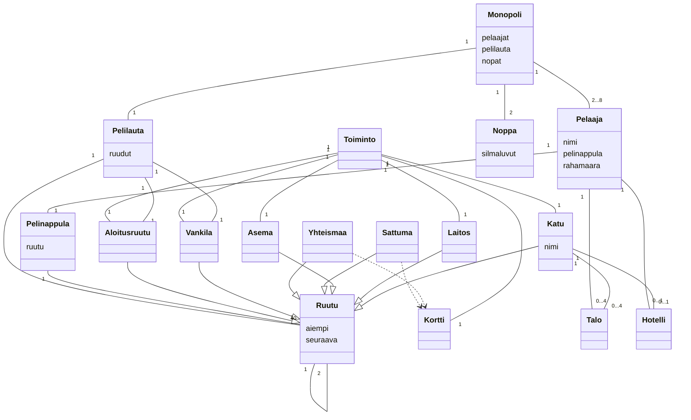

```mermaid
classDiagram
    Pelilauta "1" -- "40" Ruutu
    Monopoli "1" -- "2...8" Pelaaja
    Pelaaja "1" -- "1" Pelinappula
    Pelinappula "1" -- "1" Ruutu
    Monopoli "1" -- "2" Noppa
    Monopoli "1" -- "1" Pelilauta
    Ruutu "1" -- "2" Ruutu
    Aloitusruutu --|> Ruutu
    Vankila --|> Ruutu
    Yhteismaa --|> Ruutu
    Sattuma --|> Ruutu
    Asema --|> Ruutu
    Laitos --|> Ruutu
    Katu --|> Ruutu
    Sattuma ..> Kortti
    Yhteismaa ..> Kortti
    Toiminto "1" -- "1" Vankila
    Toiminto "1" -- "1" Aloitusruutu
    Toiminto "1" -- "1" Laitos
    Toiminto "1" -- "1" Asema
    Toiminto "1" -- "1" Kortti
    Toiminto "1" -- "1" Katu
    Pelilauta "1" -- "1" Aloitusruutu
    Pelilauta "1" -- "1" Vankila
    Pelaaja "1" -- "0...4" Talo
    Pelaaja "1" -- "0...1" Hotelli
    Katu "1" -- "0...4" Talo
    Katu "1" -- "0...1" Hotelli
    

    class Monopoli{
        pelaajat
        pelilauta
        nopat
    }
    class Pelaaja{
        nimi
        pelinappula
        rahamaara
    }
    class Pelilauta{
        ruudut
    }
    class Ruutu{
        aiempi
        seuraava
    }
    class Noppa{
        silmaluvut
    }
    class Pelinappula{
        ruutu
    }
    class Aloitusruutu
    class Vankila
    class Sattuma
    class Yhteismaa
    class Asema
    class Laitos
    class Katu{
        nimi
    }
    class Kortti
    class Toiminto
    class Talo
    class Hotelli

```