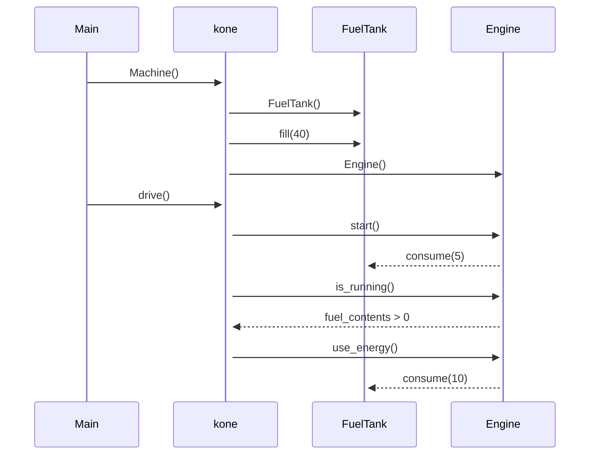

```mermaid
sequenceDiagram
    Main ->> +kone: Machine()
    kone ->> +FuelTank: FuelTank()

    kone ->> FuelTank: fill(40)
    kone ->> Engine: Engine()

    Main ->>+kone: drive()
    kone ->>+Engine: start()
    Engine -->> FuelTank: consume(5)
    kone ->> Engine: is_running()
    Engine -->> kone: fuel_contents > 0
    kone ->> Engine: use_energy()
    Engine -->> FuelTank: consume(10)
```