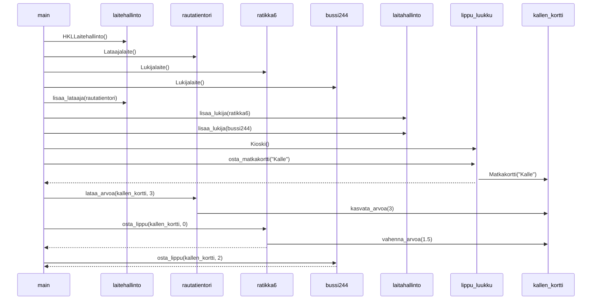

```mermaid
sequenceDiagram
    main ->> laitehallinto: HKLLaitehallinto()

    main ->> rautatientori: Lataajalaite()
    main ->> ratikka6: Lukijalaite()
    main ->> bussi244: Lukijalaite()

    main ->> laitehallinto: lisaa_lataaja(rautatientori)
    main ->> laitahallinto: lisaa_lukija(ratikka6)
    main ->> laitahallinto: lisaa_lukija(bussi244)

    main ->> lippu_luukku: Kioski()
    main ->> +lippu_luukku: osta_matkakortti("Kalle")
    lippu_luukku ->> kallen_kortti: Matkakortti("Kalle")
    lippu_luukku -->> main: 

    main ->> rautatientori: lataa_arvoa(kallen_kortti, 3)
    rautatientori ->> kallen_kortti: kasvata_arvoa(3)

    main ->> ratikka6: osta_lippu(kallen_kortti, 0)
    ratikka6 ->> kallen_kortti: vahenna_arvoa(1.5)
    ratikka6 -->> main: 

    main ->> bussi244: osta_lippu(kallen_kortti, 2)
    bussi244 -->> main: 


```